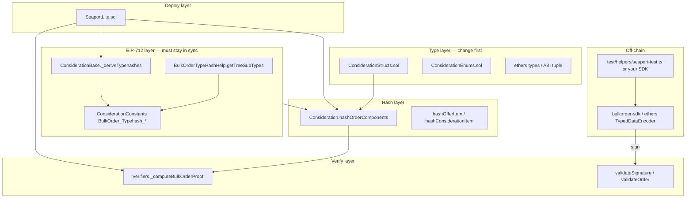

# Custom OrderComponents & BulkOrder Contract Development Guide

This guide explains how to extend **seaport-lite** with custom order schemas and ship a **Bulk Merkle batch-signature** verification contract quickly. Templates live in [`docs/templates/`](templates/).

### Terminology: “custom `OrderComponents`”

In this repo, **custom `OrderComponents` means the EIP-712 type name stays `OrderComponents`**; you may change **what is inside** it (and, if needed, nested types such as `OfferItem` / `ConsiderationItem`).

| Stays the same                                     | May change                                              |
| -------------------------------------------------- | ------------------------------------------------------- |
| Primary type name `OrderComponents`                | Field list on `OrderComponents` (add / remove / retype) |
| Bulk wrapper `BulkOrder(OrderComponents[2]… tree)` | Fields on `OfferItem` / `ConsiderationItem`             |
| Leaf = one signed `OrderComponents` structHash     | `encodeType` strings, typehashes, ABI tuple for FFI     |

You do **not** rename the struct to `MyOrderComponents` unless you intentionally fork the whole Seaport type system (out of scope for the default workflow here).

Related docs:

- [EIP-712 `encodeType` rules](eip712-type-encoding.md)
- [Sync checklist (printable)](templates/ORDER_SCHEMA_CHECKLIST.md)

---

## 1. Goals & scope

| Capability                   | seaport-lite today                      | Typical extension goal                                    |
| ---------------------------- | --------------------------------------- | --------------------------------------------------------- |
| Single EIP-712 verify        | ✅ `validateSignature`                  | Custom fields, same hash + ECDSA flow                     |
| Bulk Merkle verify           | ✅ signature length + proof → root hash | Same `OrderComponents` leaf name; inner fields may differ |
| Counter invalidation         | ✅ `getCounter` / `incrementCounter`    | Keep or replace                                           |
| On-chain fulfill / transfers | ❌                                      | Wire to Seaport or your own settlement                    |

**Rule of thumb:** on-chain verification = **matching EIP-712 domain** + **matching typeHash / structHash vs off-chain signing** + **Bulk typeHash selected by tree height**.

---

## 2. Layered architecture



**Dependency order (when changing fields, bottom-up):**

1. `ConsiderationStructs` + off-chain TypeScript types
2. `_deriveTypehashes()` + `hashOrderComponents` / item hash helpers
3. `BulkOrderTypeHashHelp.getTreeSubTypes()` (same subtype strings as step 2 if the leaf is still `OrderComponents`)
4. 24× `BulkOrder_Typehash_Height_*` in `ConsiderationConstants`
5. `ConsiderationBase._lookupBulkOrderTypehash` (constant names can stay; values must update)
6. Off-chain `EIP_712_BULK_ORDER_TYPE_DEMO` or your own types

---

## 3. Two extension modes

### Mode A: Standard Seaport field layout (recommended start)

The **`OrderComponents` name and field set** match [official Seaport](https://github.com/ProjectOpenSea/seaport). You may still change **domain** (`name` / `version` / `chainId` / `verifyingContract`) or deployment address.

| What to change        | File                                                  |
| --------------------- | ----------------------------------------------------- |
| Domain name / version | `SeaportLite._nameString()` / `_versionString()`      |
| Off-chain domain      | `test/helpers/seaport-test.ts` → `getSeaportDomain()` |
| Bulk tree             | No type-string changes                                |

Use when: your own contract address / multi-chain deploy, but orders stay byte-compatible with OpenSea/Seaport tooling.

### Mode B: Custom fields inside `OrderComponents` (name unchanged)

Add, remove, or retype **members of `OrderComponents`** (and nested items if needed). The EIP-712 primary type string still starts with `OrderComponents(` — only the **member list** inside the parentheses changes.

| Layer                | Action                                                                                                                                  |
| -------------------- | --------------------------------------------------------------------------------------------------------------------------------------- |
| Solidity struct      | `ConsiderationStructs.sol` — edit `struct OrderComponents { … }` (keep the struct name)                                                 |
| `encodeType` strings | `ConsiderationBase._deriveTypehashes()`: `OrderComponents(...)` member list + **dependencies sorted by type name**                      |
| structHash encoding  | `Consideration.hashOrderComponents`: `abi.encode(_ORDER_TYPEHASH, …)` in the **same field order** as the struct / types                 |
| Nested items         | If `OfferItem` / `ConsiderationItem` change, update their type strings and `hashOfferItem` / `hashConsiderationItem` too                |
| Dynamic arrays       | `offer` / `consideration`: `keccak256(abi.encodePacked(itemHashes))` (unchanged pattern)                                                |
| Bulk                 | Still `BulkOrder(OrderComponents[2]… tree)` in `BulkOrderTypeHashHelp` — **do not rename** the leaf type                                |
| Bulk constants       | Re-run `getBulkOrderTypeHashs()` → update `ConsiderationConstants` (subtype strings changed even if the name `OrderComponents` did not) |
| Off-chain types      | Copy [`templates/eip712-types.template.ts`](templates/eip712-types.template.ts); keep the key `OrderComponents` in ethers types         |

**Note:** any field change invalidates old signatures. Keeping `counter` / `salt` is still recommended for cancellation and uniqueness.

**Worked example** (remove `zone`, `zoneHash`, `conduitKey`, keep the type name): [examples/order-components-without-zone.md](examples/order-components-without-zone.md) and [templates/eip712-types.custom.template.ts](templates/eip712-types.custom.template.ts).

### In-repo reference variant (`CustomBulkSeaport`)

Shipped alongside `SeaportLite` (does not modify the main contract):

| Piece            | Path                                                                                                   |
| ---------------- | ------------------------------------------------------------------------------------------------------ |
| Deploy entry     | `src/CustomBulkSeaport.sol` → inherits `CustomConsideration`                                           |
| Variant modules  | `src/variants/` (`CustomConsideration*.sol`, `CustomVerifiers.sol`, `CustomBulkOrderTypeHashHelp.sol`) |
| Solidity structs | `CustomOrderComponents`, `CustomOrder`, … — EIP-712 **strings** still use `OrderComponents`            |
| Tests            | `test/CustomBulkSeaport.t.sol`, `test/GenerateCustomBulkOrderTypeHash.t.sol`                           |
| Sign / FFI       | `test/helpers/custom-bulk-seaport-test.ts`, `test/helpers/custom-bulk-eip712.ts`                       |

```bash
npm run sign-order-custom-bulk
forge test --match-contract CustomBulkSeaportTest -vvv
forge test --match-contract GenerateCustomBulkOrderTypeHash -vv   # log 24× bulk typehashes
```

---

## 4. BulkOrder specifics

### 4.1 Signature payload (Seaport-compatible)

```
[ ECDSA 64 or 65 bytes ][ 3-byte leaf index key ][ 32 × treeHeight bytes of sibling proof ]
```

- Valid length: `Verifiers._isValidBulkOrderSize` (`BulkOrderProof_minSize` + range)
- Tree height: `height = (totalLen - sigLen) / 32`, max 24 (`2^24` orders)
- Leaf hash: single `OrderComponents` structHash (**not** the bulk root hash)
- Root hash: `keccak256(bulkTypeHash, keccak256(levels…))`

### 4.2 Bulk EIP-712 type (height = 1 example)

```text
BulkOrder(OrderComponents[2] tree)ConsiderationItem(...)OfferItem(...)OrderComponents(...)
```

For height `h`, append `h` copies of `[2]` after `OrderComponents`. See `BulkOrderTypeHashHelp.sol`.

### 4.3 When `OrderComponents` members change (Bulk unchanged by name)

Bulk leaves are still **`OrderComponents` structHashes**. If you only change inner fields:

1. Update `getTreeSubTypes()` so the appended dependency strings match your `OfferItem` / `ConsiderationItem` / `OrderComponents` **member lists** (dependency **names** sorted alphabetically).
2. Keep `bytes.concat("BulkOrder(OrderComponents", brackets, " tree)", subTypes)` — the prefix type name does not change.
3. Regenerate 24 height typehashes → `ConsiderationConstants`.
4. Off-chain: `BulkOrder.tree` stays typed as `OrderComponents[2]` (at height 1); SDK field definitions must match Solidity.

`_computeBulkOrderProof` usually **does not need changes** (only `_lookupBulkOrderTypehash(height)`).

---

## 5. Recommended contract layout (later customization)

Split “order definition” from “verification entrypoint” for easier forks:

```solidity
// 1) Types + typehash derivation (pure / view)
abstract contract CustomOrderTypeHashes is ConsiderationBase {
  function _nameString() internal pure override returns (string memory) {
    return "MyMarket";
  }
  // Override member lists in _deriveTypehashes — still named "OrderComponents(...)"
}

// 2) Hashing (struct name stays OrderComponents)
abstract contract CustomOrderHasher is CustomOrderTypeHashes {
  function hashOrderComponents(
    OrderComponents calldata order
  ) internal view returns (bytes32);
}

// 3) Verify + Bulk + Counter
contract MySeaportLite is EIP712, CustomOrderHasher, CounterManager, Verifiers {
  // validateSignature / validateOrder — same pattern as Consideration
}
```

Stub: [`templates/CustomSeaportLite.sol.stub`](templates/CustomSeaportLite.sol.stub).

**Minimal in-repo path:**

| Step | Action                                                          |
| ---- | --------------------------------------------------------------- |
| 1    | Fork `ConsiderationStructs` → edit fields                       |
| 2    | Copy `ConsiderationBase._deriveTypehashes`, update type strings |
| 3    | Copy `Consideration.hashOrderComponents` + item hashes          |
| 4    | Sync `BulkOrderTypeHashHelp.getTreeSubTypes`                    |
| 5    | `forge test` + `npm run sign-bulk-order` FFI alignment          |

---

## 6. Off-chain workflow

### 6.1 Single order

```bash
# 1. Hash with the same types as the contract
npm run sign-order

# 2. Compare structHash in Forge
forge test --match-test test_validateSignature -vvv
```

`TypedDataEncoder.hashStruct("OrderComponents", types, value)` must equal `getOrderStructHash` (excluding domain).

### 6.2 Bulk order

```bash
npm run sign-bulk-order
forge test --match-test test_validateSignature_BulkOrder -vvv
```

With [bulkorder-sdk](https://www.npmjs.com/package/bulkorder-sdk), `EIP_712_BULK_ORDER_TYPE_DEMO`’s `OrderComponents` must match Solidity **field-for-field, type-for-type**.

### 6.3 Verify typeHash (CLI)

```bash
# OrderComponents (concat string from ConsiderationBase, no spaces)
cast keccak "OrderComponents(address offerer,address zone,OfferItem[] offer,ConsiderationItem[] consideration,uint8 orderType,uint256 startTime,uint256 endTime,bytes32 zoneHash,uint256 salt,bytes32 conduitKey,uint256 counter)ConsiderationItem(uint8 itemType,address token,uint256 identifierOrCriteria,uint256 startAmount,uint256 endAmount,address recipient)OfferItem(uint8 itemType,address token,uint256 identifierOrCriteria,uint256 startAmount,uint256 endAmount)"

# Bulk height 1 (fill in full subtype strings)
cast keccak "BulkOrder(OrderComponents[2] tree)ConsiderationItem(...)OfferItem(...)OrderComponents(...)"
```

On-chain (standard layout): `new BulkOrderTypeHashHelp().getBulkOrderTypeHashs()[0]`.

For **CustomBulkSeaport** (custom `OrderComponents` members): `new CustomBulkOrderTypeHashHelp().getBulkOrderTypeHashs()[0]` — see `GenerateCustomBulkOrderTypeHash` test.

### 6.4 CustomBulkSeaport (variant)

```bash
npm run sign-order-custom-bulk
npm run sign-bulk-order-custom-bulk
forge test --match-contract CustomBulkSeaportTest -vvv
```

FFI: `npx tsx test/helpers/custom-bulk-seaport-test.ts export single|bulk`. Types must use `Record<string, TypedDataField[]>` (not `as const` on the types object) so `TypedDataEncoder.hashStruct` type-checks — see `test/helpers/custom-bulk-eip712.ts`.

---

## 7. Sync checklist (pitfalls)

| #   | Check                                                                       | Single | Bulk |
| --- | --------------------------------------------------------------------------- | ------ | ---- |
| 1   | `encodeType` dependencies **sorted by type name**                           | ✅     | ✅   |
| 2   | structHash field order matches types                                        | ✅     | ✅   |
| 3   | Dynamic arrays use packed child hashes                                      | ✅     | ✅   |
| 4   | `hashOrderComponents` uses `_getCounter(offerer)` (storage)                 | ✅     | ✅   |
| 5   | Off-chain sign with `counter` = on-chain `getCounter(offerer)` at sign time | ✅     | ✅   |
| 6   | domain `verifyingContract` = deployed address                               | ✅     | ✅   |
| 7   | Bulk signature length passes `_isValidBulkOrderSize`                        | —      | ✅   |
| 8   | `BulkOrder_Typehash_Height_*` matches `getBulkOrderTypeHashs`               | —      | ✅   |
| 9   | FFI `ORDER_COMPONENTS_ABI` tuple matches struct                             | ✅     | ✅   |
| 10  | leaf index / proof matches SDK                                              | —      | ✅   |

Full checklist: [`templates/ORDER_SCHEMA_CHECKLIST.md`](templates/ORDER_SCHEMA_CHECKLIST.md).

---

## 8. Testing strategy

| Test                                           | Purpose                                                                  |
| ---------------------------------------------- | ------------------------------------------------------------------------ |
| `test_eip712Domain`                            | name / version / verifyingContract                                       |
| `test_validateSignature`                       | FFI signature ↔ `validateOrder`                                         |
| `test_validateSignature_BulkOrder`             | Merkle + bulk typehash                                                   |
| `test_getBulkOrderTypeHashs`                   | 24 height constants                                                      |
| `test_incrementCounter_invalidatesPriorOrders` | prior signature fails after `incrementCounter` (storage counter in hash) |
| `test_customOrder_*` (yours)                   | Golden `orderHash` after field changes                                   |
| `CustomBulkSeaportTest`                        | Variant domain + slimmer `OrderComponents`                               |
| `GenerateCustomBulkOrderTypeHash`              | Console log bulk typehashes for `CustomConsiderationConstants`           |

**Tip:** pin a golden `orderHash` per schema revision (see `assertEq(orderhash, 0x9361…)` in `SeaportLite.t.sol`; `test_orderTypehashConstant` in `CustomBulkSeaport.t.sol` for the variant).

---

## 9. Differences vs official Seaport

| Topic                           | Official Seaport                       | seaport-lite                                                                          |
| ------------------------------- | -------------------------------------- | ------------------------------------------------------------------------------------- |
| fulfill / transfers             | ✅                                     | ❌                                                                                    |
| counter in order hash at verify | **storage** counter when deriving hash | **Same** — `hashOrderComponents` uses `_getCounter(offerer)`                          |
| `order.counter` in calldata     | checked on some fulfill paths          | **Not asserted** on `validateOrder` / `validateSignature` (hash already uses storage) |
| `incrementCounter`              | quasi-random jump                      | Same `CounterManager`                                                                 |
| Bulk algorithm                  | Same                                   | Same                                                                                  |

To verify the **same** signatures as mainnet Seaport, domain and type strings must match mainnet. For your own deployment only, this repo is the source of truth.

---

## 10. Quick start

**New fork from scratch**

1. Copy [`templates/eip712-types.template.ts`](templates/eip712-types.template.ts) → `test/helpers/my-order-types.ts`
2. Copy [`templates/CustomSeaportLite.sol.stub`](templates/CustomSeaportLite.sol.stub) → `src/MySeaportLite.sol`
3. Follow [ORDER_SCHEMA_CHECKLIST](templates/ORDER_SCHEMA_CHECKLIST.md) for Solidity + TS
4. `forge test` + `tsx test/helpers/seaport-test.ts export bulk`
5. Write bulk typehashes into `ConsiderationConstants` (`forge test --match-contract GenerateCustomBulkOrderTypeHash -vv` for the variant layout)

**Study the shipped variant**

1. Read [order-components-without-zone.md](examples/order-components-without-zone.md)
2. Run `npm run sign-order-custom-bulk` and `forge test --match-contract CustomBulkSeaportTest`
3. Diff `src/lib/` vs `src/variants/` when copying patterns

---

## 11. File index

### `SeaportLite` (standard `OrderComponents`)

| File                                 | Role                                         |
| ------------------------------------ | -------------------------------------------- |
| `src/lib/ConsiderationStructs.sol`   | Order structs                                |
| `src/lib/ConsiderationBase.sol`      | `_ORDER_TYPEHASH`, bulk lookup               |
| `src/lib/Consideration.sol`          | hash + `validateSignature` / `validateOrder` |
| `src/lib/BulkOrderTypeHashHelp.sol`  | Generate 24 bulk typehashes                  |
| `src/lib/ConsiderationConstants.sol` | Bulk typehash + proof length constants       |
| `src/lib/Verifiers.sol`              | Bulk proof merge                             |
| `src/lib/CounterManager.sol`         | Counter storage / increment                  |
| `src/SeaportLite.sol`                | Deploy entry (domain name)                   |
| `test/helpers/seaport-test.ts`       | Sign + FFI                                   |
| `test/SeaportLite.t.sol`             | On-chain verification tests                  |

### `CustomBulkSeaport` (custom fields, same EIP-712 type names)

| File                                            | Role                                                           |
| ----------------------------------------------- | -------------------------------------------------------------- |
| `src/CustomBulkSeaport.sol`                     | Deploy entry (`CustomBulkSeaport` / `1.0`)                     |
| `src/variants/CustomConsiderationStructs.sol`   | `CustomOrderComponents`, `CustomOrder`, items                  |
| `src/variants/CustomConsideration.sol`          | hash + validate                                                |
| `src/variants/CustomConsiderationBase.sol`      | typehashes + bulk lookup                                       |
| `src/variants/CustomConsiderationConstants.sol` | `CustomOrderComponents_TYPEHASH`, `CustomBulkOrder_Typehash_*` |
| `src/variants/CustomBulkOrderTypeHashHelp.sol`  | Regenerate bulk type strings                                   |
| `src/variants/CustomVerifiers.sol`              | Bulk proof                                                     |
| `test/helpers/custom-bulk-eip712.ts`            | ethers types + struct hash helper                              |
| `test/helpers/custom-bulk-seaport-test.ts`      | Sign + FFI                                                     |
| `test/CustomBulkSeaport.t.sol`                  | Variant verification tests                                     |
| `test/GenerateCustomBulkOrderTypeHash.t.sol`    | Log bulk constants to console                                  |
